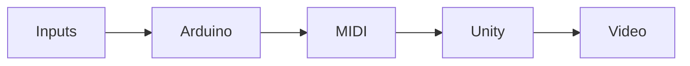

# Puppet Synth

intro

## Project brief

client, aim, timeline

### Team

name, role, github handle

Lisa Bach (@ ) - Unity 3D and creative direction(????).......

Silvan Roth (@sullyjason) - Interface design and hardware

Jan Hügli - Prototyping and production

Jan Thürig (@ ) - Unity 3D .............

Jan Espig (@ ) - Visual Design

## Concept

## Implementation
    

### Visual Style
### Unity 3D

flow chart

### Interface

## Result

## Repository files

Firmware (arduino code)

Electronic Design files

CAD drawings and STLs

Unity image and packages

