# Puppet Synth

A collaborative project between ZHdK's Departments of Interaction Design and Game Design, commissioned by Museum für Gestaltung.

## Project brief

For the Exhibition "Museum of the Future" in 2025, Zürich's Museum für Gestaltung has commissioned ZHdK to develop a series of interactive installations paying tribute to Sophie Täuber Arp's infamous wooden marionettes that she created for the play _King Stag_.

### Team

The team consists of five members coming from various disciplines.

- Lisa Bach (@ ) - Unity 3D and creative direction
- Silvan Roth (@sullyjason) - Interface design and hardware
- Jan Hügli - Prototyping and production
- Jan Thürig (@ ) - Unity 3D, development
- Jan Espig (@ ) - Visual design
- Lars Kristian Blom & David Bock - Sound design

## Concept

Puppet Synth is a digital reinterpretation of Sophie Taeuber-Arp’s avant-garde puppetry for King Stag, breaking with traditional visual and performative conventions. Inspired by Rudolf Laban’s choreographic notation and Taeuber-Arp’s expressive dance practice, this project brings the puppets’ gestures into the digital realm. Users are invited to choreograph puppet movements themselves. Visually, Puppet Synth renders these complex motion sequences as wave-like frequency patterns, making them both tangible and analyzable.

 
## Implementation

```mermaid
flowchart TD
    Interface["🎛️ Physical Interface"] --> Arduino["Analog Signal processing"]
    Arduino --> MIDI["🎹 MIDI / Control Signal"]

    MIDI --> WaveSynthesis["Wave synthesis"] --> FMOD["🔊 FMOD (Audio Synthesis)"]
    WaveSynthesis --> UnityAnim["🕺 Unity Animator (Puppet Control)"]

    FMOD --> Audio["🎵 Dynamic Audio Output"]
    UnityAnim --> Visual["🎭 Puppet Animation in Unity"]

    Audio & Visual --> Output["🎬 Final Experience (Live AV Performance)"]
```

### Interface

The interface consists of 5 types of inputs: rotary switches, smooth rotary potentiometers, linear potentiometers (faders), and momentary 3 position toggle switches.

### Visual Style

The visual style takes inspiration from Sophie Täuber-Arp's minimal color palette and simple revolved shapes that make up the marionettes.

## Experience

## Repository files

- Firmware (arduino code)
- Electronic Design files
- CAD drawings and STLs
- Unity build and packages
- FMOD code

